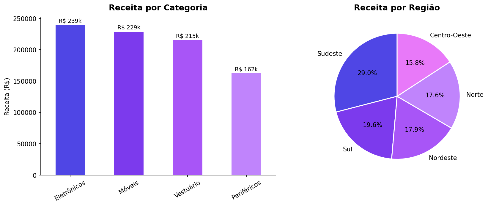

# Análise de Vendas — TechStore

Análise exploratória de dados de vendas de um e-commerce multi-categoria, com foco em identificar os produtos, categorias e regiões que mais contribuem para a receita do negócio.

---

## Perguntas respondidas

- Qual categoria gera mais receita para o negócio?
- Quais produtos lideram em volume de vendas e em faturamento?
- Existe concentração geográfica nas vendas? Qual região domina?
- Como a receita está distribuída entre as regiões do Brasil?

---

## Principais resultados

| Indicador | Resultado |
|---|---|
| Receita total | R$ 845.852 |
| Período analisado | Jan–Dez 2025 |
| Total de transações | 100 |
| Categoria líder | Eletrônicos (R$ 239.389 — 28% da receita) |
| Produto mais vendido (volume) | Sofá Q (30 unidades) |
| Produto maior faturamento | Sofá Q (R$ 77.777) |
| Região com maior receita | Sudeste (R$ 245.605 — 29% do total) |

---

## Insights de negócio

**Eletrônicos domina, mas Móveis é mais eficiente por produto.** Eletrônicos lidera em receita total (R$ 239k), mas o Sofá Q — da categoria Móveis — é o produto individual com maior faturamento e maior volume de vendas. Isso indica que poucos produtos de alto valor em Móveis têm impacto desproporcional na receita.

**Sudeste concentra quase 1 em cada 3 reais vendidos.** Com 29% da receita total, o Sudeste é a região dominante. Norte e Nordeste juntos representam 35% — um mercado relevante que pode estar subexplorado dependendo da estratégia de distribuição.

**A receita é distribuída entre 4 categorias sem grande desequilíbrio.** Eletrônicos (28%), Móveis (27%), Vestuário (25%) e Periféricos (19%) mostram uma base diversificada, o que reduz a dependência de um único segmento.

---

## Visualizações



---

## Stack utilizada

- **Python 3** — linguagem principal
- **Pandas** — manipulação e agregação de dados
- **Matplotlib** — visualizações
- **Jupyter Notebook** — ambiente de análise

---

## Como executar

```bash
git clone https://github.com/dieegomarcelo/analise-vendas-techstore.git
cd analise-vendas-techstore
pip install pandas matplotlib
jupyter notebook analise_vendas_techstore.ipynb
```

O arquivo `vendas.csv` já está incluído no repositório.

---

## Sobre o projeto

Este projeto faz parte do meu portfólio de análise de dados. Outros projetos disponíveis no [perfil do GitHub](https://github.com/dieegomarcelo).
